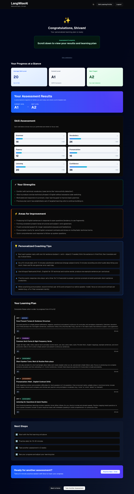
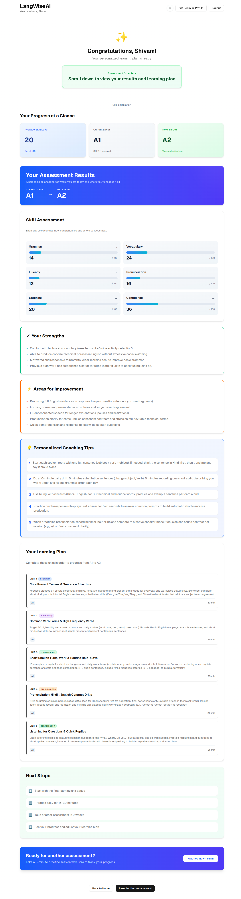

# LangWiseAI – AI Voice Language Assessment

LangWiseAI is an AI‑powered **spoken language coach** that runs a short voice conversation with each learner and turns it into a **personalized learning plan and progress dashboard**.  
Under the hood it uses **Next.js**, **Supabase**, **Agora Conversational AI**, and **OpenAI Realtime**, deployed on **Vercel** with the **Vercel × Supabase integration**.

<div align="center">
  
  
</div>

---

## Highlights

- **Real conversation, not multiple‑choice**: Learners speak with "Sora", an AI tutor, in their target language over low‑latency voice.
- **Automatic skill scoring**: Grammar, Vocabulary, Fluency, Pronunciation, Listening, and Confidence are evaluated from real conversation.
- **Personalized learning plan**: The app generates structured learning units with difficulty levels, time estimates, and coaching tips.
- **Progress dashboard**: A clean dashboard shows strengths, weak areas, current CEFR‑style level, and a clear next step.

## 📸 [View All Screenshots](docs/screenshots.md)

See the complete user interface across all flows in both dark and light themes.

---

## User journey

1. **Sign up and onboarding**
   - Sign up with email (Supabase Auth).
   - Fill a short form with:
     - **Native language**
     - **Target language**
     - **Learning goal**
     - **Short bio** (used to personalize Sora’s prompts)
2. **Speak with Sora**
   - Start a **3‑minute** voice call with Sora via Agora.
   - Sora conducts a natural conversation tailored to the learner’s goal and background.
3. **AI analysis**
   - The conversation transcript is stored in Supabase.
   - The backend calls an analysis model (via the Vercel AI SDK and `ANALYSIS_MODEL`) to:
     - Score core skills.
     - Infer current CEFR‑style level and a realistic next level.
     - Generate a structured personalized plan.
4. **Review your plan**
   - The learner lands on a dashboard with:
     - **Skill bars** and trends.
     - **Recommended learning units** (with time estimates).
     - **Coaching tips** and a call to action to keep practicing.

---

## Architecture overview

- **Frontend (`app`, `components`)**
  - Built with **Next.js App Router** and **React**.
  - Contains:
    - **Onboarding flow** (`app/onboarding`) to collect learner profile.
    - **Assessment screen** (`app/assessment`) with Sora, timer, and live status.
    - **Dashboard** (`app/dashboard`) to show skills and learning plan.
  - Uses a Tailwind‑style design system and shared UI primitives in `components/ui`.

- **Realtime voice & agent (`lib/agora-*`, `app/api/agora/*`)**
  - Browser connects to **Agora RTC** using `NEXT_PUBLIC_AGORA_APP_ID`.
  - Server:
    - Generates RTC tokens in `app/api/agora/generate-token/route.ts`.
    - Starts/stops Agora Conversational AI agents via `lib/agora-utils.ts`.
  - Agents are configured to talk to **OpenAI Realtime** for low‑latency conversational AI.

- **AI analysis (`lib/analysis-utils.ts`, `app/api/analyze-transcript`)**
  - The transcript is passed to `analyzeTranscriptWithAI` with:
    - Native language
    - Target language
    - Learner goal
    - Previous plan (if any)
  - Uses **Vercel AI SDK** and `ANALYSIS_MODEL` to produce a strongly‑typed JSON plan:
    - Skill scores
    - CEFR levels
    - Learning units
    - Coaching tips

- **Data & auth (`lib/supabase/*`, `lib/utils-db.ts`, `lib/auth-*`)**
  - **Supabase Auth** handles email sign‑up/login.
  - **Supabase Postgres** stores:
    - Users
    - Assessment sessions
    - Transcripts
    - Personalized plans
  - `lib/utils-db.ts` wraps Supabase queries into typed helper functions.
  - `lib/auth-actions.ts` and `lib/auth-context.ts` manage authentication flows and session state.

- **Hosting & infra**
  - Deployed on **Vercel**.
  - **Supabase** is connected via the official Vercel integration, which:
    - Provisions the database.
    - Injects Supabase environment variables.

---

## Key concepts

- **Assessment session**
  - Represents a single 3‑minute call with Sora.
  - Stores channel info, transcript, and status (active/completed).

- **Transcript**
  - Text representation of the conversation between learner and Sora.
  - Used as the input for downstream AI analysis.

- **Personalized plan**
  - Structured object built by the analysis model.
  - Contains:
    - Skill levels and trends.
    - CEFR current/next level.
    - A sequence of learning units.
    - Coaching tips, strengths, and weak areas.

---

## Project structure

- **`app/`**: Next.js routes and pages (`/`, `/onboarding`, `/assessment`, `/dashboard`, API routes under `/api`).
- **`components/`**: UI components including:
  - Assessment timer, Sora status, feedback messages.
  - Dashboard cards and charts.
  - Auth provider and protected route wrapper.
- **`lib/`**:
  - `agora-*`: Agora client, hooks, token logic, and REST helpers.
  - `supabase/`: Browser and server Supabase clients.
  - `utils-db.ts`: Typed data access helpers for users, sessions, transcripts, and plans.
  - `analysis-utils.ts`: Transcript analysis and plan generation.
  - `types.ts`: Shared TypeScript types.
- **`supabase/`**:
  - `migrations/001_initial_schema.sql`: Database schema and policies.
- **`docs/`**:
  - `quick-start.md`: Full setup and run guide.
  - `supabase-setup.md`: Database and auth details.
  - `agora-setup.md`: Agora and OpenAI Realtime configuration.
  - `screenshots.md`: UI screenshots across all flows (dark and light themes).

---

## Getting started

For full, step‑by‑step instructions (Vercel setup, Supabase integration, Agora/OpenAI env vars), see:

- `docs/quick-start.md`
- `docs/supabase-setup.md`
- `docs/agora-setup.md`

**Quick version:**

1. **Clone and install**

```bash
pnpm install
```

2. **Configure environment**
   - Deploy/import the project on Vercel.
   - Add the **Supabase integration** to your Vercel project (automatically creates the DB and sets:
     - `NEXT_PUBLIC_SUPABASE_URL`
     - `NEXT_PUBLIC_SUPABASE_ANON_KEY`
     - `SUPABASE_SERVICE_ROLE_KEY`
   - Add Agora and OpenAI env vars in Vercel:
     - `AGORA_APP_ID`, `AGORA_APP_CERTIFICATE`, `AGORA_CUSTOMER_ID`, `AGORA_CUSTOMER_SECRET`
     - `NEXT_PUBLIC_AGORA_APP_ID`
     - `OPENAI_REALTIME_URL`, `OPENAI_REALTIME_API_KEY`, `OPENAI_REALTIME_MODEL`, `OPENAI_REALTIME_VOICE`
     - `ANALYSIS_MODEL`
   - Copy these values into a local `.env.local` for development.

3. **Run the Supabase migration**
   - Open Supabase dashboard → SQL Editor.
   - Run the SQL from `supabase/migrations/001_initial_schema.sql`.

4. **Start the dev server**

```bash
pnpm dev
```

Then open `http://localhost:3000` and walk through the full flow: login → onboarding → 3‑minute call → instant plan & dashboard.
