## Screenshots

This document showcases the LangWiseAI user interface across all flows. Screenshots are grouped by theme so you can view the complete user journey in **dark** mode, then **light** mode.

---

## Dark Theme

### 1. Login

The authentication screen where users sign up or log in with email and password.

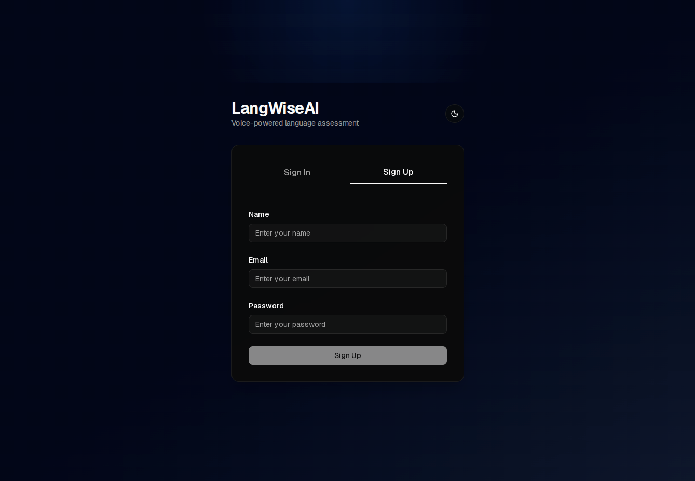

---

### 2. Onboarding Flow

A multi-step onboarding process that collects user preferences and learning goals.

#### Step 1: Language Selection

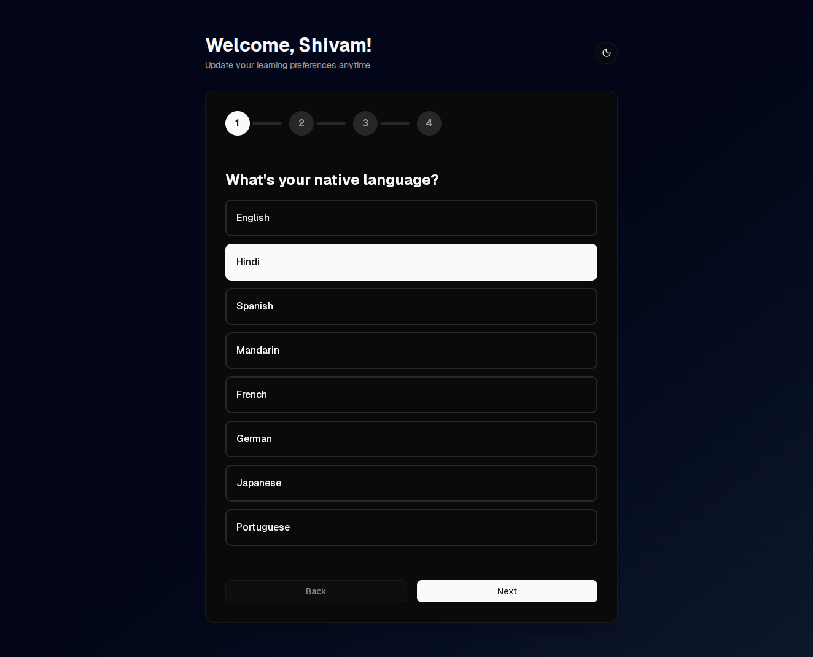

#### Step 2: Target Language

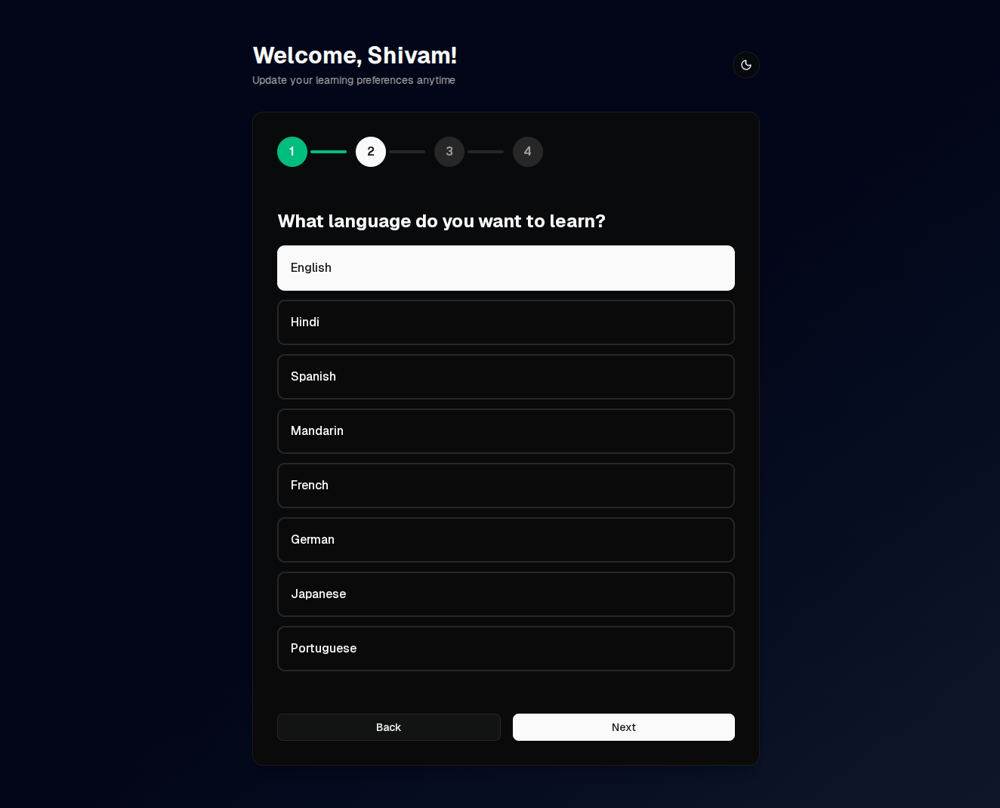

#### Step 3: Learning Goal

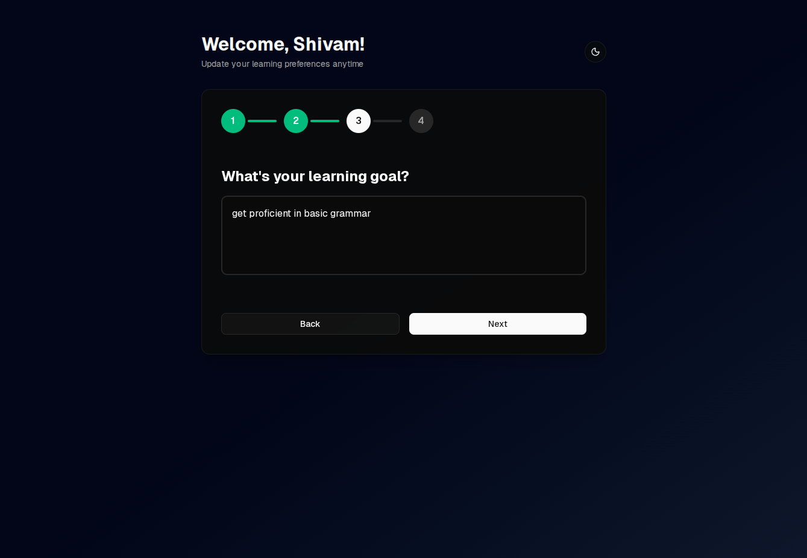

#### Step 4: Bio

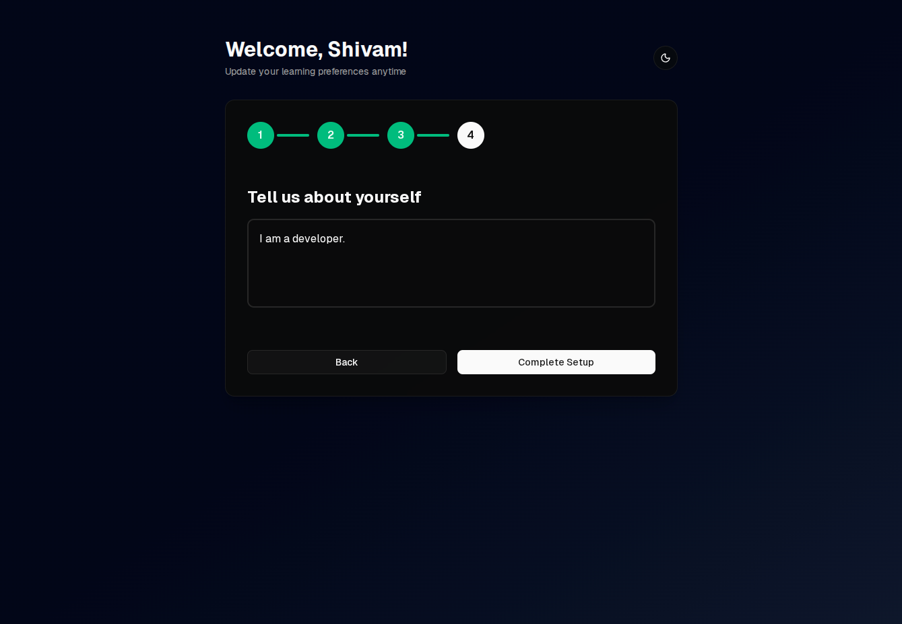

---

### 3. Assessment Flow

The voice conversation interface where users speak with Sora, the AI tutor, for 3 minutes.

#### Step 1: Assessment In Progress

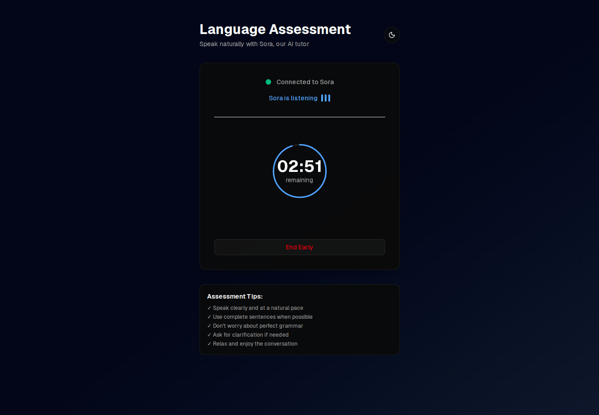

#### Step 2: Assessment Analysis

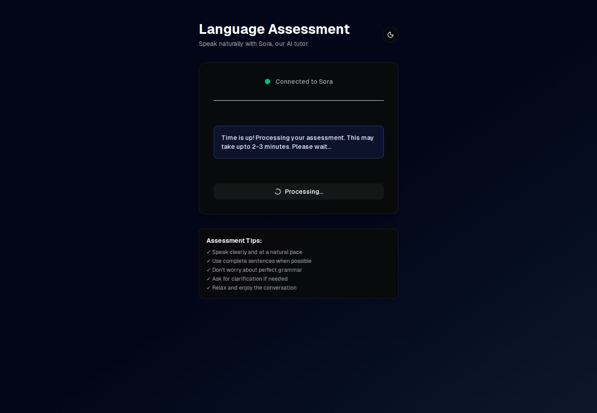

---

### 4. Dashboard

The personalized learning plan and progress dashboard showing skill scores, learning units, and coaching tips.

---

## Light Theme

### 1. Login

The authentication screen where users sign up or log in with email and password.

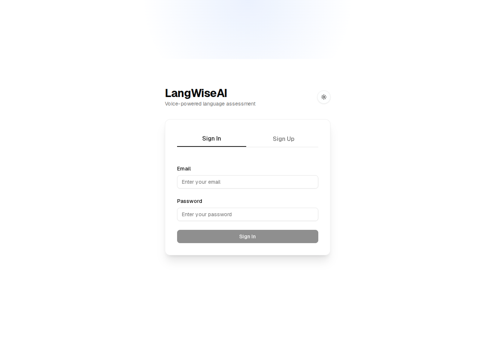

---

### 2. Onboarding Flow

A multi-step onboarding process that collects user preferences and learning goals.

#### Step 1: Language Selection

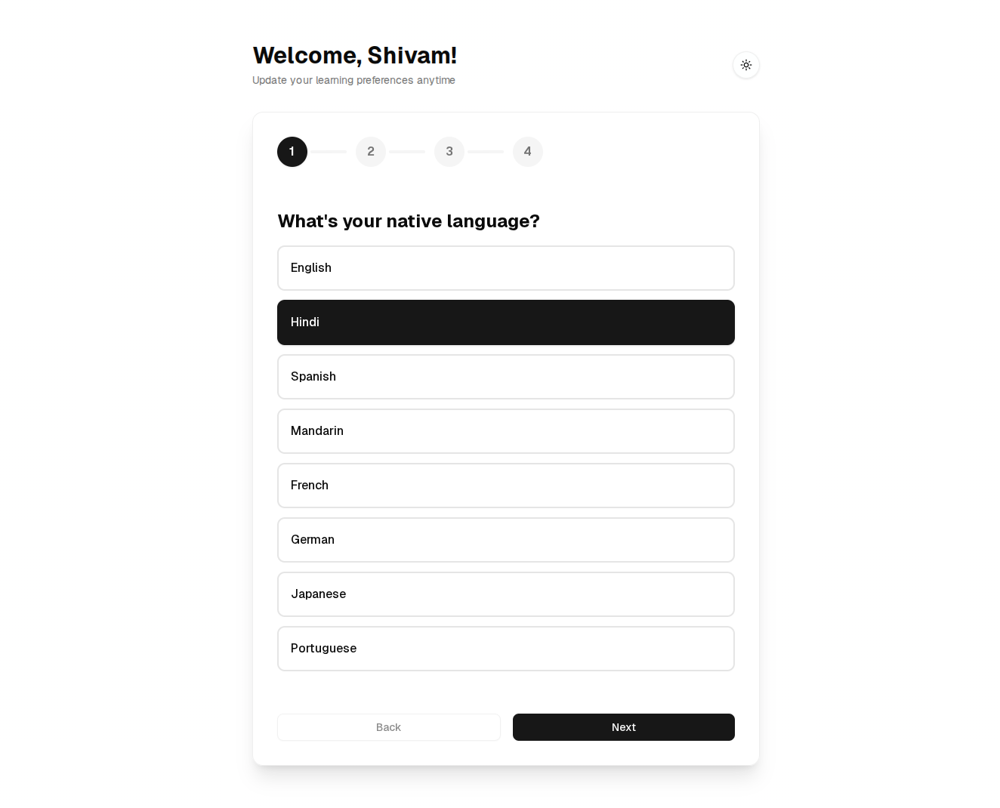

#### Step 2: Target Language

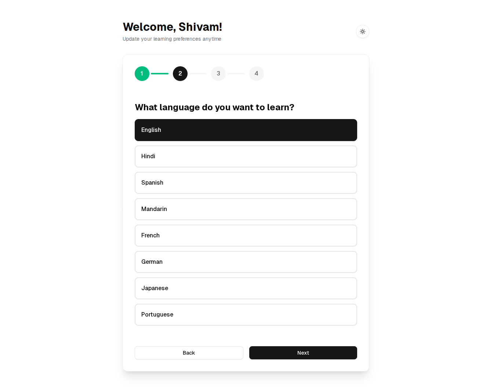

#### Step 3: Learning Goal

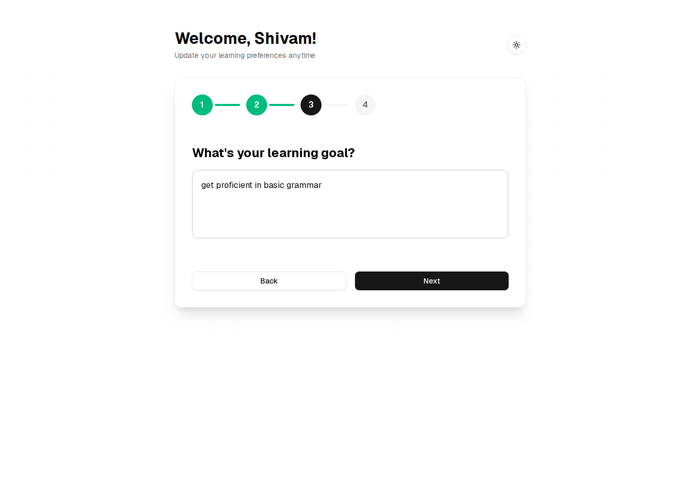

#### Step 4: Bio

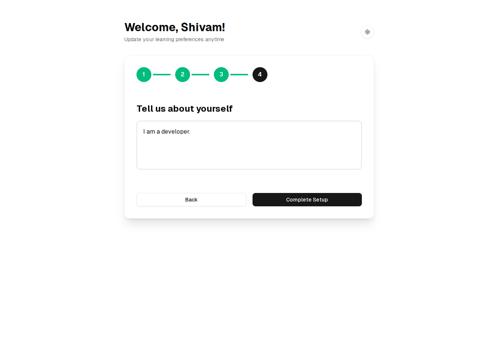

---

### 3. Assessment Flow

The voice conversation interface where users speak with Sora, the AI tutor, for 3 minutes.

#### Step 1: Assessment In Progress

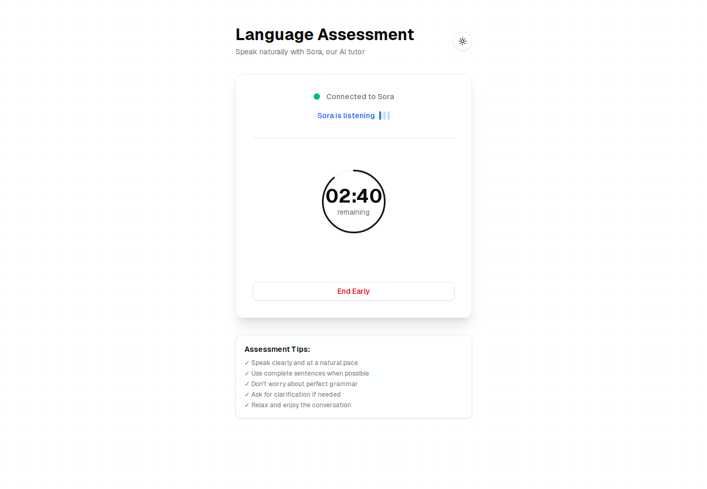

#### Step 2: Assessment Analysis

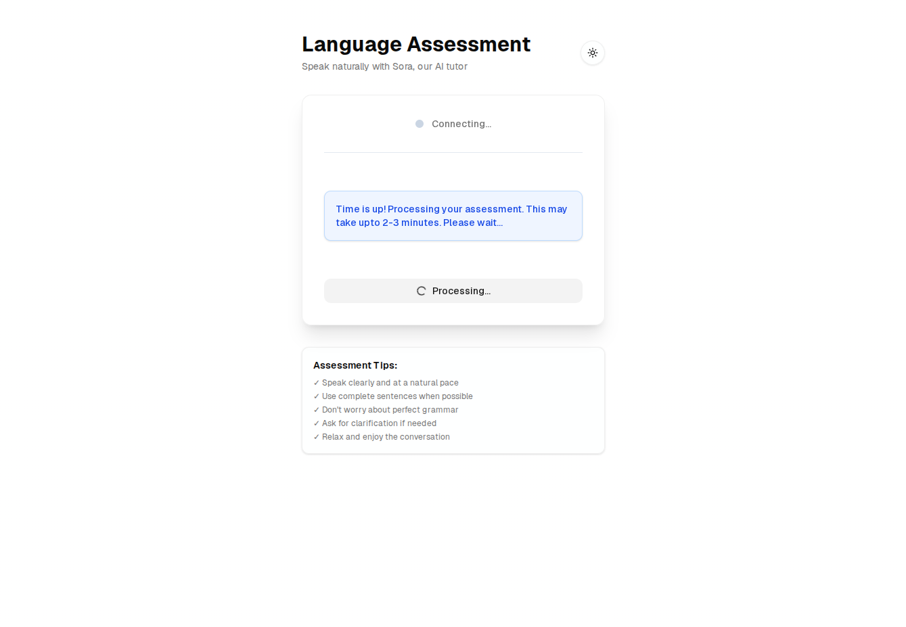

---

### 4. Dashboard

The personalized learning plan and progress dashboard showing skill scores, learning units, and coaching tips.

---

## User Journey Summary

The complete flow follows this sequence:

1. **Login** → Sign up or authenticate
2. **Onboarding** → Set up profile (4 steps)
3. **Assessment** → Voice conversation with Sora (2 steps)
4. **Dashboard** → View personalized plan and progress

For more details about the user journey and features, see the [main README](../README.md).
